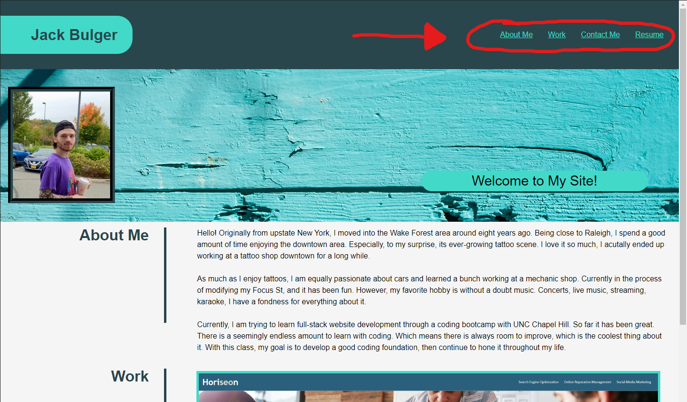
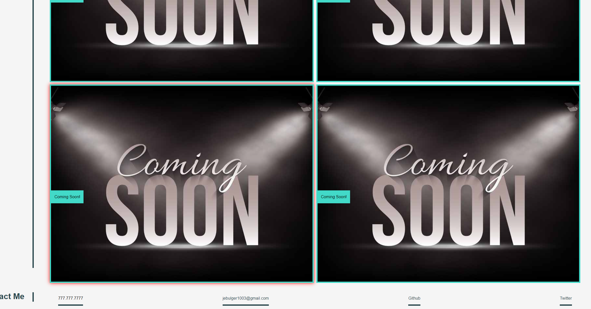
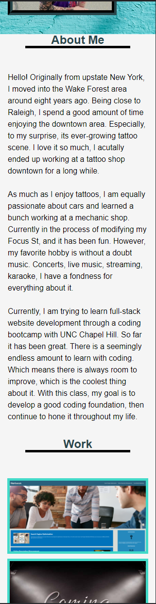
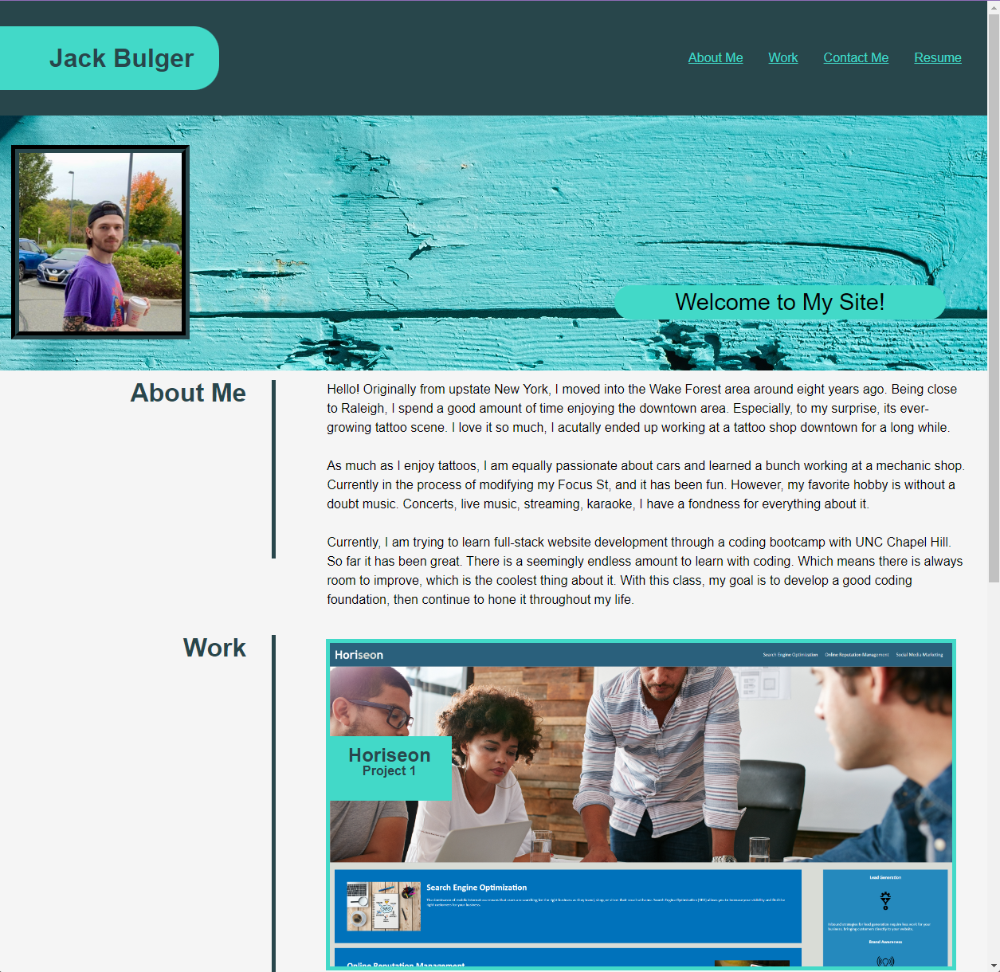

# My Portfolio

## Description
The goal for this project is to set up a portfolio that I can use throughout my time in bootcamp to store the projects and applications I work on. The portfolio also includes an introductory about me section and ways to contact me.

## Table of Contents
- [Installation](#installation)
- [Usage](#usage)
- [Sidenote](#sidenote)
- [Deployed Site](#deployed-site)

## Installation
All that is required is an internet browser of your choice.

## Usage
Open the webpage up in a browser and device of your choice. As you scroll the page you will see a section that contain information about me, a section with my work, and a section with ways to contact me.  
  
However, there are navigation links at the top of the page that link to the corresponding sections below:

Try hovering over one of the clickable images and you will see their border light up red!

The page is also mobile responsive - try shrinking the page to see how the layout changes with the size of the screen.  

## Sidenote
1. I do not have an official resume yet, for now the link will just route to the top of the page.  
2. The 777-777-7777 number is just a placeholder, it will not actually call me.  
3. I do not use social media, so the twitter link just routes to twitter's home page.
4. The email link is actually my email, same with the github link actually linking to my github page.

## Deployed Site
**[Live URL here: _https://jebulger.github.io/my-portfolio/_](https://jebulger.github.io/my-portfolio/)**  

